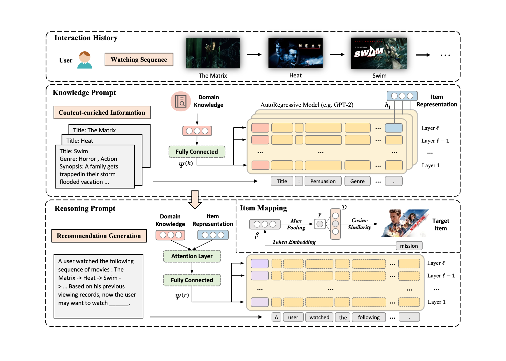

# LANCER


## Introduction

we propose LANCER, a novel paradigm that utilizes a language model as a sequential recommender, effectively integrating domain-specific knowledge and general knowledge of the PLM to learn dynamic user interests. Our approach employs a knowledge prompt to facilitate the acquisition of item content and a reasoning prompt to enable the integration of both domain-specific knowledge and user behavior for personalized recommendation. We highlight the potential of our approach in bridging the gap between language models and recommender systems and provide experimental results to support its effectiveness in incorporating item content understanding. We hope that this work will inspire future researchers to delve into content-based modeling for recommendation using language models, thereby fostering iterative advancements in the field of recommender systems.

## Requirements
- Python====3.10.5
- numpy==1.24.2
- torch==1.12.1+cu116
- transformers==4.27.1
- matplotlib
- tqdm

## Usage
```
python run.py
```
Further information on the parameters can be found in `utils/args.py` and adjusted.

## Acknowledgements
The code implementations of our baselines refer to [RecBole](https://github.com/RUCAIBox/RecBole).

The dataset we use comes from [MovieLens](https://grouplens.org/datasets/movielens/), [MIND](https://msnews.github.io/), and [Goodreads](https://sites.google.com/eng.ucsd.edu/ucsdbookgraph/home).